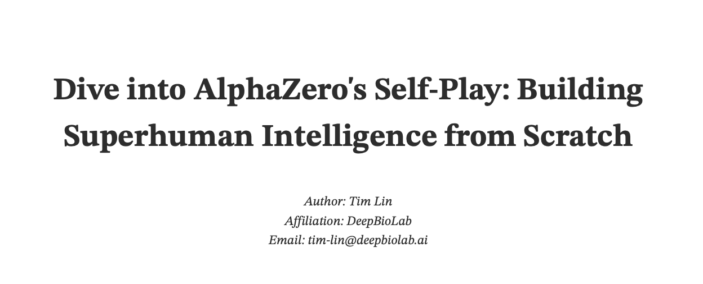

# Illustrated AlphaZero

A Python implementation of the AlphaZero algorithm for board games, with detailed illustrations and explanations.

A detailed blog-style explanation of the AlphaZero algorithm can be found [here](blog/dive-into-alphazero.pdf).




## Overview


AlphaZero is a groundbreaking algorithm that combines Monte Carlo Tree Search (MCTS) with deep neural networks to achieve superhuman performance in board games. This project provides a detailed implementation of AlphaZero, including the core components and a user-friendly interface for interactive play.

This project implements the core concepts of the AlphaZero algorithm, featuring:
- Monte Carlo Tree Search (MCTS)
- Deep Neural Network Policy
- Self-play Training
- Board Game Environment (e.g., TicTacToe)

## Project Structure

```
illustrated-alphazero/
├── src/
│   ├── agent.py        # MCTS Agent implementation
│   ├── config.py       # Configuration settings
│   ├── environment.py  # Game environment
│   ├── interact.py     # GUI for human interaction
│   ├── network.py      # Neural network architecture
│   ├── search.py       # Monte Carlo Tree Search
│   ├── transform.py    # Board state transformations
│   └── utils.py        # Utility functions
├── checkpoints/        # Model checkpoints
├── main.py             # Training entry point
├── playground.py       # Interactive game environment
└── README.md
```

## Key Components

### MCTS Search
- Selection: Choose promising nodes using UCB scores
- Expansion: Create child nodes for unexplored states
- Evaluation: Use neural network to evaluate positions
- Backpropagation: Update node statistics

### Neural Network
- Policy Head: Predicts move probabilities
- Value Head: Estimates position value
- Convolutional Features: Extracts board patterns

### Self-play Training
- Game simulation through MCTS
- Data collection from self-play games
- Neural network training with collected examples


## Installation

```bash
git clone https://github.com/deepbiolab/illustrated-alphazero.git
cd illustrated-alphazero
pip install -r requirements.txt
```

## Usage

### Configuration

Key parameters in `config.py`:

```python
ENV_SETTINGS = {
	"size": (3, 3),  		# Board size
	"N": 3,          		# Number in a row to win
}
NUM_EPISODES = 400          # Total training episodes
SIMULATIONS_PER_MOVE = 100  # MCTS simulations per move
...
```

### Training AlphaZero

```bash
python main.py
```

The `main.py` script trains the AlphaZero model using the specified configuration. It simulates self-play games, collects data, and trains the neural network.

- Evaluating model performance during training


### Playing Against Trained Model

```bash
python playground.py
```

The `playground.py` script provides a graphical interface for playing against the trained model. You can interact with the game using the provided GUI in different game modes:

1. **Human vs Human**: Two players take turns making moves.
2. **Human vs Random**: Play against a random AI opponent.
3. **Human vs AI**: Play against the trained AlphaZero model.
4. **AI vs AI**: Watch the trained AlphaZero model play against itself.

```bash
Available Game Modes:
1: Red: Human vs Blue: Human
2: Red: Human vs Blue: Random
3: Red: Human vs Blue: AI
4: Red: AI vs Blue: AI

Select game mode (1-4): 
```

## Contributing

Contributions are welcome! Please feel free to submit a Pull Request.

## License

This project is licensed under the MIT License - see the LICENSE file for details.

## Acknowledgments

- Inspired by DeepMind's AlphaZero papers
- Built with PyTorch deep learning framework

## References

1. Silver, D., et al. (2017). Mastering Chess and Shogi by Self-Play with a General Reinforcement Learning Algorithm
2. Silver, D., et al. (2018). A general reinforcement learning algorithm that masters chess, shogi, and Go through self-play